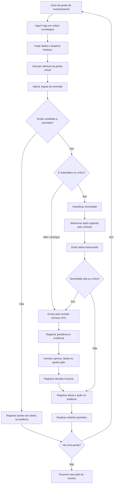

# BPMN To-Be - Monitor de Anomalias

Este fluxo representa o processo proposto para a Tarefa 02: o log deixa de ser analisado apenas no fim do período e passa a ser monitorado em janelas, com alerta, revisão humana e auditoria.

## Pontos de Decisão

- `Existe candidato a anomalia?`: verifica se alguma regra atingiu volume, taxa ou desvio acima do limiar.
- `É sistemático ou crítico?`: confirma se a regra apareceu em janelas consecutivas ou se é uma regra crítica, como MAC duplicado.
- `Severidade alta ou crítica?`: envia casos de maior risco para revisão humana obrigatória.

## Trilhas de Auditoria

- Toda janela processada gera uma linha em `saida_monitor/auditoria.csv`.
- Todo alerta gera uma linha em `saida_monitor/alertas.csv`.
- Todo caso com HITL gera uma linha em `saida_monitor/revisao_humana.csv`.
- A avaliação contra gabarito, quando fornecida, gera `saida_monitor/avaliacao.csv`.
